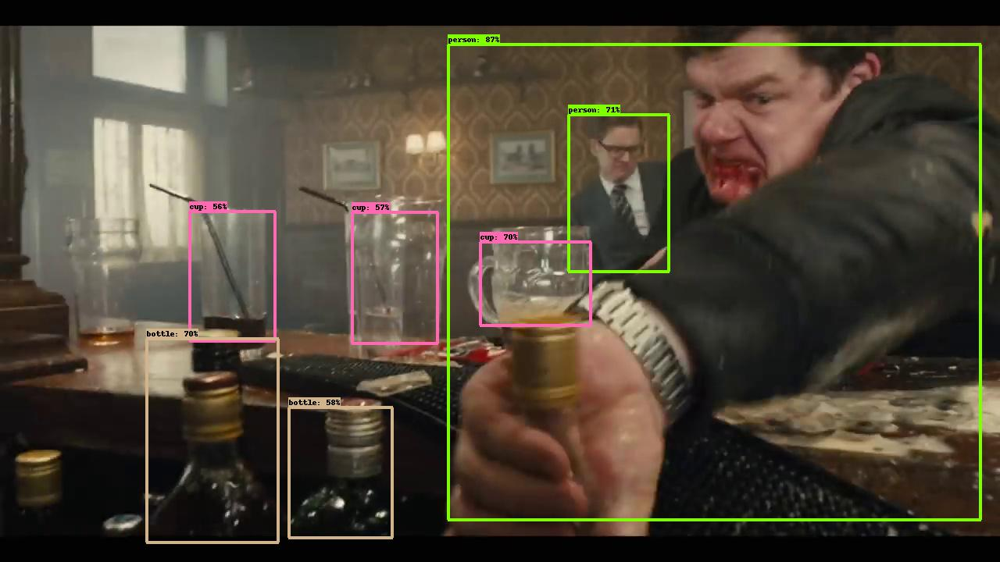

# Seq_nms_YOLO

#### Membres: Yunyun SUN, Yutong YAN, Sixiang XU, Heng ZHANG
#### Modified by: [David García de la Horra](https://github.com/DavidGarcíadelaHorra) and [Fangfang Zhu-Zhou](https://github.com/FangfangZhuZhou)

## Introduction

 

This project combines **YOLOv2**([reference](https://arxiv.org/abs/1506.02640)) and **seq-nms**([reference](https://arxiv.org/abs/1602.08465)) 
to realise **real time video detection**.

It is part of an academic assigment from the Master's Degree of Deep Learning for Audio and Video Signal Processing of 
the Autonomous University of Madrid. Concretely from the Deep Learning for Image Signal Processing. 
The objective for this assignment is to compare Seq-NMS-Yolov2 against just using Yolov2 approaches for video object detection task

## Steps

1. Download repository code:
   - If you want to make changes just locally: click on `<> Code` button and choose `Download ZIP` and unzip the downloaded .zip file.
   - If you want to create a remote repository, run `git clone https://github.com/DavidGarciadelaHorra/seq_nms_yolo.git`.

2. Change to the repository directory: `cd seq_nms_yolo-main` if local repository or `cd seq_nms_yolo` if remote repository.

3. Create virtual environment based on the `seq_nms_yolo.yml` file by running:
   1. `conda env create -f lab2_DL4VSP.yml -n <your_env_name>`.
   2. `conda activate <your_env_name>`

4. Modify `Makefile` using your own configuration:
   * Line 1: `GPU`. Set to 1 if GPU available
   * Line 2: `CUDNN`. Set to 1 if your computer supports CUDNN
   * Line 3: `OPENCV`. Set to 1 if your computer supports OPENCV
   * Line 7: point to path of the used conda environment
   * Lines 52 and 54: fill with you own CUDA version

5. Make the project: `make`

6. Copy a video file to the video folder to which you wish to perform object detection. 

7. Perform object detection:
   - If you want to use the YOLOv2 with seq-NMS approach run: `bash run_seqNMS-yolo.sh <your_video_file_name>`
   - If you want to use the YOLOv2 with seq-NMS approach run: `bash run_only-yolo.sh <your_video_file_name>`

8. The `video/output.mp4` file will contain the resulted video object detection.

## Reference

This project copies lots of code from [darknet](https://github.com/pjreddie/darknet) , [Seq-NMS](https://github.com/lrghust/Seq-NMS) and  [models](https://github.com/tensorflow/models).